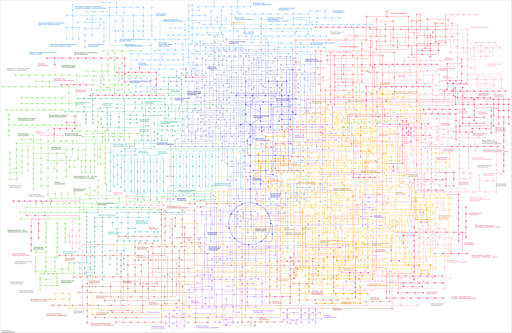

# Metabolism pathway 

### Provided by Gao Senquan, Chen Shurui, Diao Tongxin and Lu Minsi in THU.

Most of our figures are genrated by [Escher](https://github.com/zakandrewking/escher/) and [COBRApy](https://opencobra.github.io/cobrapy/) models in [Jupyter Lab](https://jupyter.org/), we use `COBRA` as an anlysis tool based on omic data flow to reveal how the metabolism flow actually works in the living body.

This document is organized with 

- [Metabolism pathway](#metabolism-pathway)
    - [Provided by Gao Senquan, Chen Shurui, Diao Tongxin and Lu Minsi in THU.](#provided-by-gao-senquan-chen-shurui-diao-tongxin-and-lu-minsi-in-thu)
  - [Metabolism Overview](#metabolism-overview)
  - [Central carbon Metabolism](#central-carbon-metabolism)
  - [Fatty acid Metabolism](#fatty-acid-metabolism)
  - [Amino acid Metabolism](#amino-acid-metabolism)
  - [Nucleotide Metabolism](#nucleotide-metabolism)
  - [Citation](#citation)

## Metabolism Overview

<object width="75%" height="1000px" data="example_map.html"></object>
("")

## Central carbon Metabolism

<object width="75%" height="1000px" data="example_map.html"></object>
("")

## Fatty acid Metabolism

<object width="75%" height="1000px" data="example_map.html"></object>
("")

## Amino acid Metabolism

<object width="75%" height="1000px" data="example_map.html"></object>
("")

## Nucleotide Metabolism

<object width="75%" height="1000px" data="example_map.html"></object>
("")

## Citation