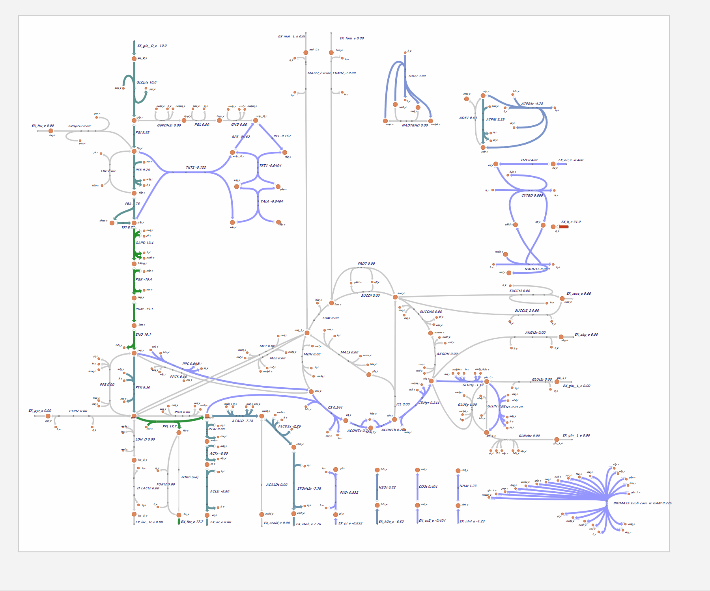
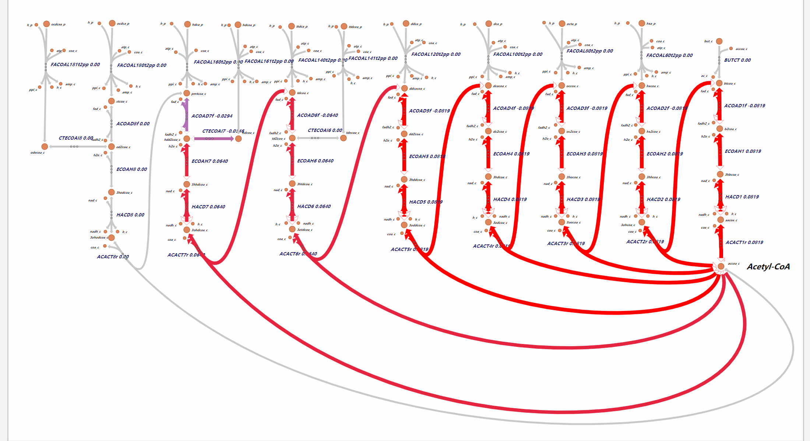

# 1. Metabolism pathway

__Provided by Gao Senquan, Chen Shurui, Diao Tongxin and Lu Minsi. We've also push it to `Github` repository
 (Available at [https://github.com/maxwell-gao/CH_metabolism_path](https://github.com/maxwell-gao/CH_metabolism_path))__

## 1.1. __Preface__

The majority of our figures are generated by [`Escher`](https://github.com/zakandrewking/escher/), [`COBRApy`](https://opencobra.github.io/cobrapy/) and models in [`Jupyter Lab`](https://jupyter.org/). The `BioRender` is also used for figure creating. 

We use `COBRA` as an analyzing tool based on omics data flux to reveal how the metabolism flux actually works in the living body. 

This comprehensive homework is composed of three major parts: the source code we use, the figures we draw with various tools (we believe that you may find them so different from each other soon😂), and the document you are reading now (in the HTML form and the markdown form). 

We aim to provide a creative form for biochemistry reviewing and understanding though we know that’s a hard work. 

- [1. Metabolism pathway](#1-metabolism-pathway)
  - [1.1. __Preface__](#11-preface)
  - [1.2. __Metabolism Overview__](#12-metabolism-overview)
    - [1.2.1. The core metabolism](#121-the-core-metabolism)
  - [1.3. __Central carbon Metabolism__](#13-central-carbon-metabolism)
    - [1.3.1. Flux of central carbon](#131-flux-of-central-carbon)
    - [1.3.2. EMP, TCA and PPP](#132-emp-tca-and-ppp)
    - [1.3.3. Glycolysis and Glycolytic Enzymes](#133-glycolysis-and-glycolytic-enzymes)
    - [1.3.4. Glycogen Degradation](#134-glycogen-degradation)
    - [1.3.5. Krebs Cycle](#135-krebs-cycle)
    - [1.3.6. Pentose Phosphate Pathway](#136-pentose-phosphate-pathway)
    - [1.3.7. Oxidative Phosphorylation](#137-oxidative-phosphorylation)
    - [1.3.8. Warburg Effect](#138-warburg-effect)
    - [1.3.9. The Cori Cyle: An Anaerobic Metabolic Method for Glucogenesis](#139-the-cori-cyle-an-anaerobic-metabolic-method-for-glucogenesis)
  - [1.4. __Fatty acid Metabolism__](#14-fatty-acid-metabolism)
    - [1.4.1. Fatty Acid](#141-fatty-acid)
  - [1.5. __Amino acid Metabolism__](#15-amino-acid-metabolism)
    - [1.5.1. Amino Acid Catabolism and Urea Cycle](#151-amino-acid-catabolism-and-urea-cycle)
    - [1.5.2. Metabolism of Amino Acid Carbon Skeletons](#152-metabolism-of-amino-acid-carbon-skeletons)
  - [1.6. __Nucleotide Metabolism__](#16-nucleotide-metabolism)
    - [1.6.1. Nucleotide Metabolism](#161-nucleotide-metabolism)
  - [1.7. __Reference__](#17-reference)

## 1.2. __Metabolism Overview__

### 1.2.1. The core metabolism


<object width="75%" height="800px" data="Core.html"></object>

## 1.3. __Central carbon Metabolism__

### 1.3.1. Flux of central carbon
<object width="75%" height="1000px" data="CarbonMeta.html"></object>

### 1.3.2. EMP, TCA and PPP
<object width="75%" height="500px" data="EMP_TCA_PPP.html"></object>

### 1.3.3. Glycolysis and Glycolytic Enzymes


### 1.3.4. Glycogen Degradation


### 1.3.5. Krebs Cycle


### 1.3.6. Pentose Phosphate Pathway


### 1.3.7. Oxidative Phosphorylation


### 1.3.8. Warburg Effect


### 1.3.9. The Cori Cyle: An Anaerobic Metabolic Method for Glucogenesis 


## 1.4. __Fatty acid Metabolism__

### 1.4.1. Fatty Acid



<object width="75%" height="1000px" data="FAS.html"></object>

<object width="75%" height="1000px" data="FattyAcid.html"></object>


## 1.5. __Amino acid Metabolism__

<object width="75%" height="1000px" data="AA.html"></object>

### 1.5.1. Amino Acid Catabolism and Urea Cycle


### 1.5.2. Metabolism of Amino Acid Carbon Skeletons


## 1.6. __Nucleotide Metabolism__

<object width="75%" height="1000px" data="Nucleotide.html"></object>

### 1.6.1. Nucleotide Metabolism


## 1.7. __Reference__
```
Heirendt L, Arreckx S, Pfau T, et al. Creation and analysis of biochemical constraint-based models using the COBRA Toolbox v. 3.0[J]. Nature protocols, 2019, 14(3): 639-702.
Rowe E, Palsson B O, King Z A. Escher-FBA: a web application for interactive flux balance analysis[J]. BMC systems biology, 2018, 12(1): 84.
Brunk E, Sahoo S, Zielinski D C, et al. Recon3D enables a three-dimensional view of gene variation in human metabolism[J]. Nature biotechnology, 2018, 36(3): 272.
Nelson D L, Lehninger A L, Cox M M. Lehninger principles of biochemistry[M]. Macmillan, 2008.
Nelson D L, Cox M M. Lehninger Principles of Biochemistry Lecture Notebook[M]. Macmillan, 2004.
```
